


# Отчет





## Практическая работа №5





## Работа с несколькими окнами (Activity)



**Выполнил:**  
Юрьев Глеб Евгеньевич 
**Курс:** 2  
**Группа:** ИНС-б-о-24-1

**Проверил:**   
Потапов И.Р. 

---

### Цель работы

Научиться создавать многоэкранные приложения, осуществлять навигацию между активностями (Activity) и передавать данные между ними с использованием объектов Intent и механизма startActivityForResult / onActivityResult.

### Ход работы
1. Создадим главную Activity - интерфейс с двумя кнопками: "Настройки" и "Об авторе", а также добавим элемент (например, TextView или ImageView), который будет изменяться в зависимости от выбранных настроек.



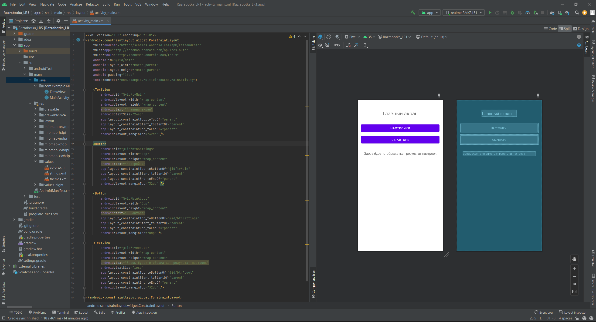

*Рисунок 1. Создание и настройка главной Acivity*



2. Создадим Activity "Настройки" (SettingsActivity). 
Сделаем по второму способу (вручную) и выполним разработку интерфейса.



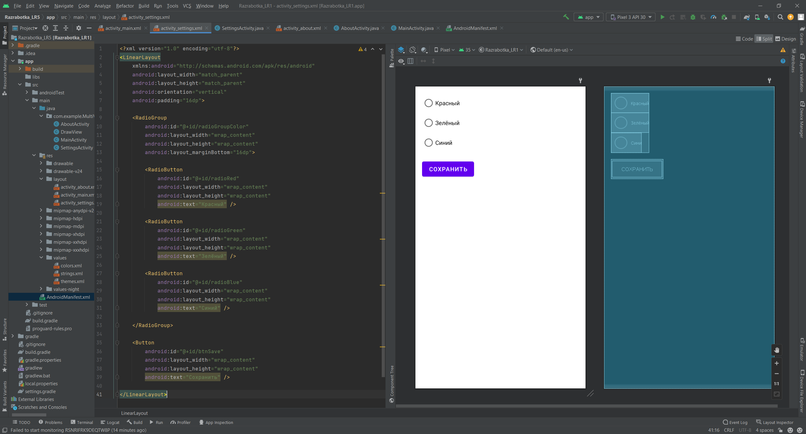





*Рисунок 2. Настройка файла activity_settings*

 

Также пропишем код с настройками для файла SettingsActivity.java:



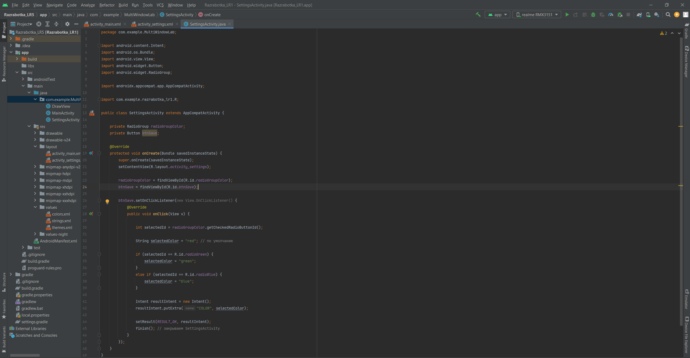





*Рисунок 3. Настройка файла SettingsActivity.java*

 

3.  Создадим Activity "Об авторе" (AboutActivity). 



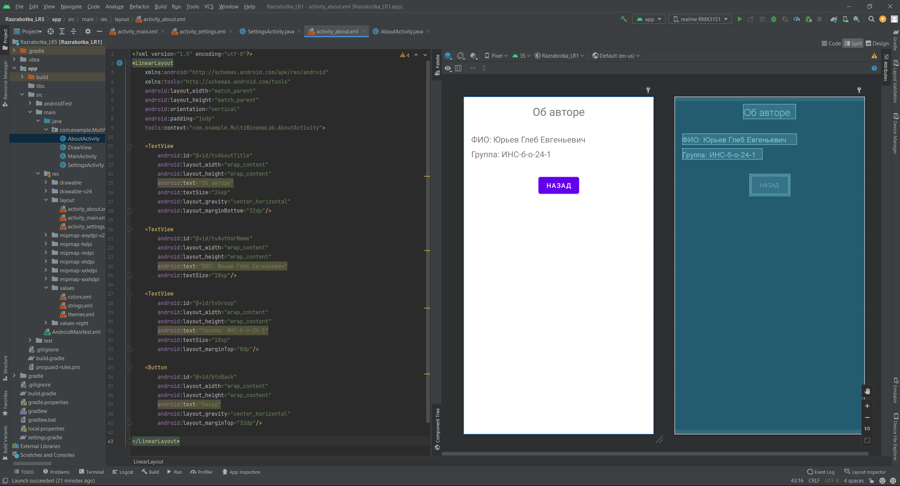





*Рисунок 4. Код activity_about.xml*

 



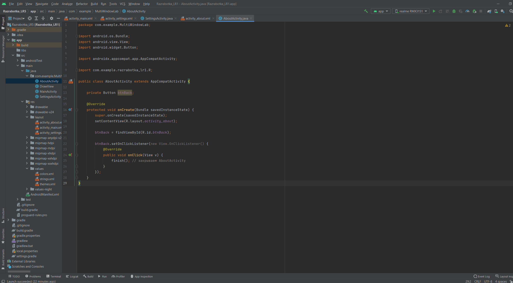





*Рисунок 5. Код AboutActivity.java*

 

4. Реализуем навигацию в MainActivity. Также сдлаем поправки в файле AndroidManifest.xml для корректного вывода.
Код в файле MainActivity.java:

<pre>
package com.example.MultiWindowLab;

import android.content.Intent;
import android.os.Bundle;
import android.view.View;
import android.widget.Button;
import android.widget.TextView;

import androidx.annotation.Nullable;
import androidx.appcompat.app.AppCompatActivity;

import com.example.razrabotka_lr1.R;

public class MainActivity extends AppCompatActivity {

    private static final int REQUEST_CODE_SETTINGS = 1;

    private TextView tvResult;
    private View mainLayout;

    @Override
    protected void onCreate(Bundle savedInstanceState) {
        super.onCreate(savedInstanceState);
        setContentView(R.layout.activity_main);

        Button btnSettings = findViewById(R.id.btnSettings);
        Button btnAbout = findViewById(R.id.btnAbout);

        tvResult = findViewById(R.id.tvResult);
        mainLayout = findViewById(R.id.main);

        btnSettings.setOnClickListener(new View.OnClickListener() {
            @Override
            public void onClick(View v) {

                Intent intent = new Intent(MainActivity.this, SettingsActivity.class);
                startActivityForResult(intent, REQUEST_CODE_SETTINGS);

            }
        });

        btnAbout.setOnClickListener(new View.OnClickListener() {
            @Override
            public void onClick(View v) {

                Intent intent = new Intent(MainActivity.this, AboutActivity.class);
                startActivity(intent);

            }
        });
    }

    @Override
    protected void onActivityResult(int requestCode, int resultCode, @Nullable Intent data) {
        super.onActivityResult(requestCode, resultCode, data);

        if (requestCode == REQUEST_CODE_SETTINGS) {
            if (resultCode == RESULT_OK && data != null) {

                String color = data.getStringExtra("COLOR");

                tvResult.setText("Выбран цвет: " + color);

                if (color.equals("red")) {
                    mainLayout.setBackgroundColor(getResources().getColor(android.R.color.holo_red_light));
                }
                else if (color.equals("green")) {
                    mainLayout.setBackgroundColor(getResources().getColor(android.R.color.holo_green_light));
                }
                else if (color.equals("blue")) {
                    mainLayout.setBackgroundColor(getResources().getColor(android.R.color.holo_blue_light));
                }
            }
        }
    }
}
</pre>

Сделаем исправления в файле AndroidManifest.xml:



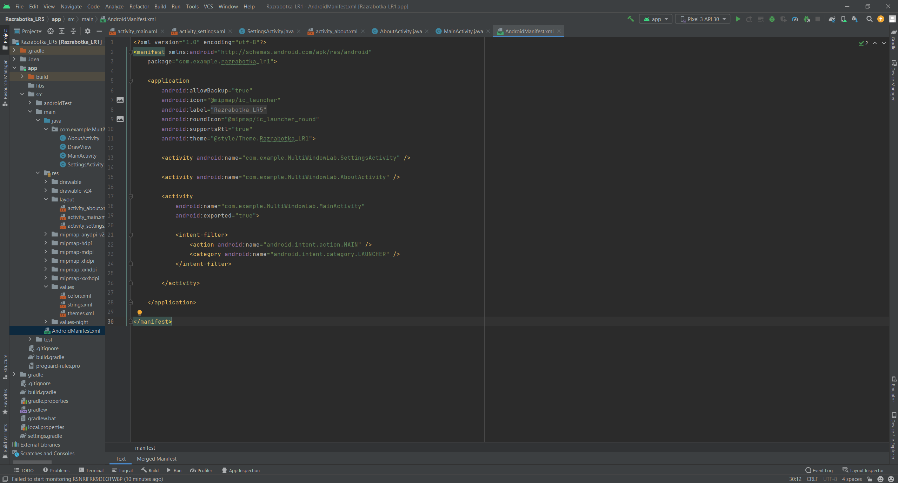

*Рисунок 6. Исправленный файл AndroidManifest.xml*



Запустим файл MainActivity, и посмотрим результат:





*Рисунок 7. Результат*





## ИНДИВИДУАЛЬНОЕ ЗАДАНИЕ



5. Возьмём вариант 8. Смена изображения в ImageView на главной странице (не менее 3 разных картинок).



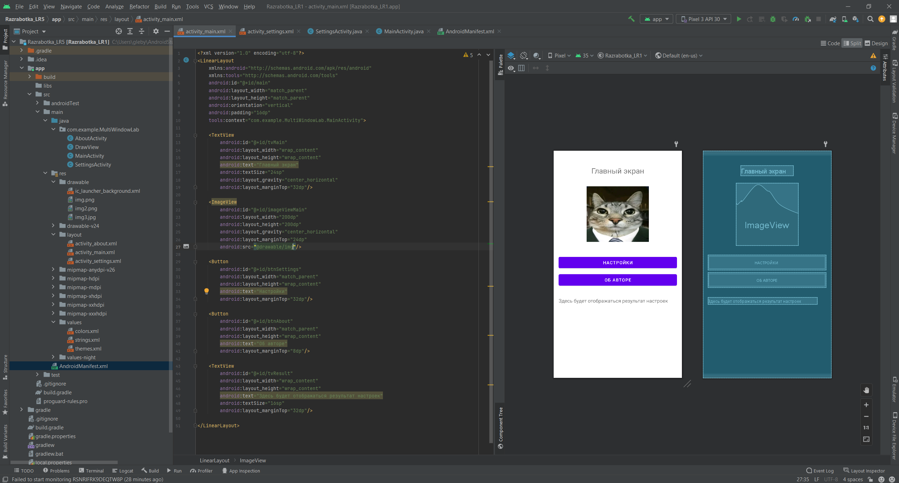

*Рисунок 8. Код activity_main.xml*





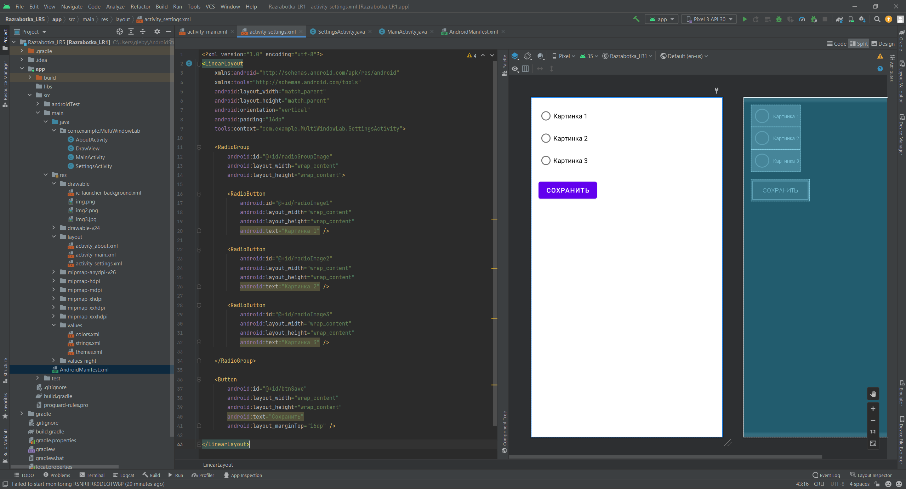

*Рисунок 9. Код activity_settings.xml*





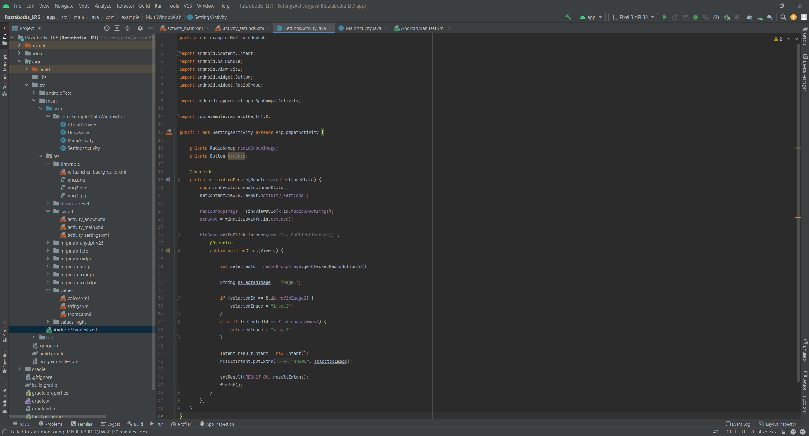

*Рисунок 10. Код SettingsActivity.java*



Код файла MainActivity.java:
<pre>
package com.example.MultiWindowLab;

import android.content.Intent;
import android.os.Bundle;
import android.view.View;
import android.widget.Button;
import android.widget.ImageView;
import android.widget.TextView;

import androidx.annotation.Nullable;
import androidx.appcompat.app.AppCompatActivity;

import com.example.razrabotka_lr1.R;

public class MainActivity extends AppCompatActivity {

    private static final int REQUEST_CODE_SETTINGS = 1;

    private TextView tvResult;
    private ImageView imageViewMain;

    @Override
    protected void onCreate(Bundle savedInstanceState) {
        super.onCreate(savedInstanceState);
        setContentView(R.layout.activity_main);

        Button btnSettings = findViewById(R.id.btnSettings);
        Button btnAbout = findViewById(R.id.btnAbout);

        tvResult = findViewById(R.id.tvResult);
        imageViewMain = findViewById(R.id.imageViewMain);

        btnSettings.setOnClickListener(new View.OnClickListener() {
            @Override
            public void onClick(View v) {

                Intent intent = new Intent(MainActivity.this, SettingsActivity.class);
                startActivityForResult(intent, REQUEST_CODE_SETTINGS);

            }
        });

        btnAbout.setOnClickListener(new View.OnClickListener() {
            @Override
            public void onClick(View v) {

                Intent intent = new Intent(MainActivity.this, AboutActivity.class);
                startActivity(intent);

            }
        });
    }

    @Override
    protected void onActivityResult(int requestCode, int resultCode, @Nullable Intent data) {
        super.onActivityResult(requestCode, resultCode, data);

        if (requestCode == REQUEST_CODE_SETTINGS) {
            if (resultCode == RESULT_OK && data != null) {

                String image = data.getStringExtra("IMAGE");

                tvResult.setText("Выбрана картинка: " + image);

                if (image.equals("image1")) {
                    imageViewMain.setImageResource(R.drawable.img);
                }
                else if (image.equals("image2")) {
                    imageViewMain.setImageResource(R.drawable.img2);
                }
                else if (image.equals("image3")) {
                    imageViewMain.setImageResource(R.drawable.img3);
                }
            }
        }
    }
}
</pre>



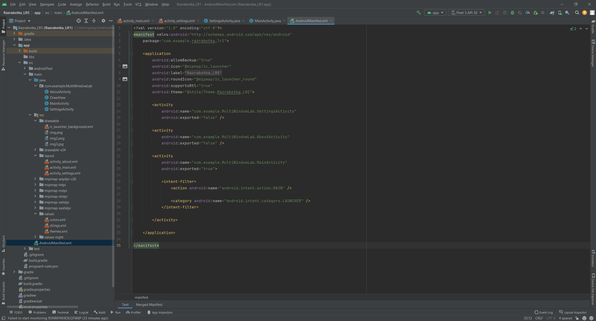

*Рисунок 11. Код AndroidManifest.xml*



Запустим файл MainActivity.Java и посмотрим результат:



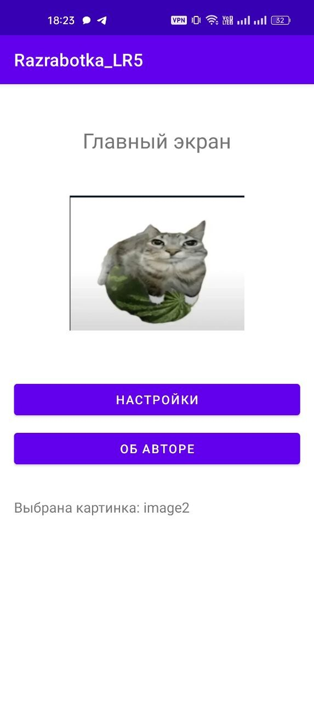

*Рисунок 12. Результат кода по индивидуальному заданию*



### Вывод
В ходе работы было создано многоэкранное Android-приложение с навигацией между Activity и передачей данных через Intent и startActivityForResult. Реализован экран настроек и экран «Об авторе», а также изменение изображения на главной странице.
### Ответы на контрольные вопросы
1.  **Вопрос 1: Что такое Intent? Какие существуют типы Intent (явные и неявные)? Приведите примеры использования каждого типа.** 
Intent — это объект для запуска Activity и передачи данных между компонентами приложения. Явные Intent используются для перехода к конкретной Activity внутри приложения (например, открытие SettingsActivity), неявные — для вызова внешних действий системы или других приложений (например, открытие браузера или камеры).
2.  **Вопрос 2: Как передать данные из одной Activity в другую с помощью Intent? Какие ограничения на типы передаваемых данных существуют?**
Данные передаются через методы putExtra() и getExtra() объекта Intent. Передавать можно простые типы данных, строки, массивы, а также объекты, реализующие Serializable или Parcelable.
3.  **Вопрос 3: В чем разница между методами startActivity() и startActivityForResult()? В каких случаях используется каждый из них?**
Метод startActivity() используется для простого перехода к другой Activity без возврата результата, а startActivityForResult() применяется, когда нужно получить данные обратно после завершения дочерней Activity
4. **Вопрос 4: Опишите назначение методов setResult() и finish() в контексте возврата данных из дочерней Activity.**
Метод setResult() устанавливает результат, который будет передан обратно в вызывающую Activity, а метод finish() завершает текущую Activity и возвращает управление предыдущей.
5. **Вопрос 5: Что произойдёт, если не зарегистрировать Activity в файле AndroidManifest.xml?** 
Если Activity не зарегистрировать в AndroidManifest.xml, приложение завершится с ошибкой при попытке открыть эту Activity.
6. **Вопрос 6: Какие методы жизненного цикла Activity вызываются при переходе от MainActivity к SettingsActivity и при возврате обратно?** 
При переходе от MainActivity к SettingsActivity вызываются методы onPause() и onStop() у MainActivity и onCreate(), onStart(), onResume() у SettingsActivity, при возврате вызываются onPause(), onStop(), onDestroy() у SettingsActivity и onRestart(), onStart(), onResume() у MainActivity.
7. **Вопрос 7: Для чего используется requestCode в методе startActivityForResult()? Как обрабатываются несколько различных запросов в onActivityResult()?** 
Параметр requestCode используется для различения запросов при запуске нескольких Activity через startActivityForResult(), а в методе onActivityResult() по нему определяется, от какой именно Activity получен результат.